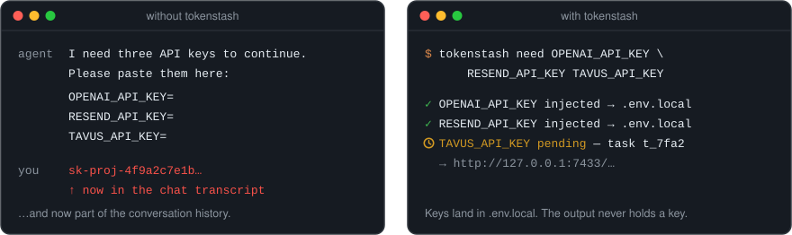
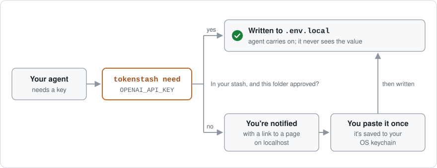
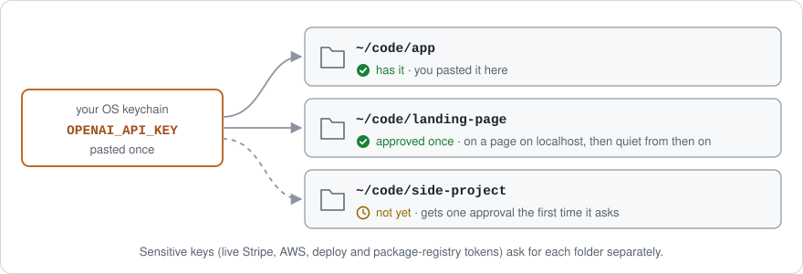
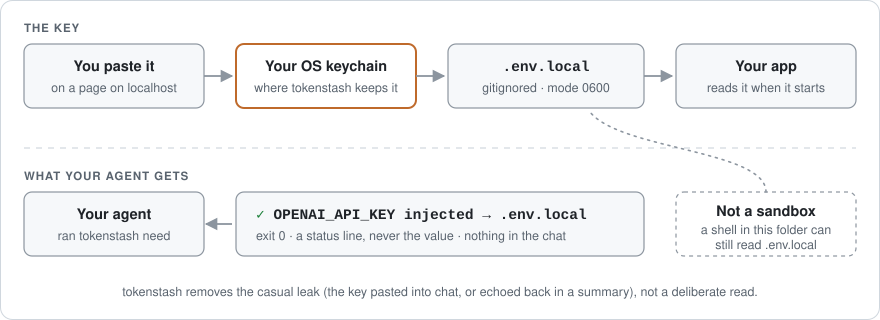

<h1 align="center">tokenstash</h1>

<p align="center">
  <strong>Paste a key once. Approve each directory. Keep secrets out of status output.</strong>
</p>

<p align="center">
  A local credential broker for coding agents. When your agent needs an API key, it asks tokenstash instead of asking you to paste it into the chat. The key goes into your project's env file, and the agent gets back a status line instead of the key.
</p>

<p align="center">
  <a href="https://github.com/kgarg2468/tokenstash/releases/latest"><strong>Download</strong></a> ·
  <a href="SECURITY.md"><strong>Security</strong></a> ·
  <a href="CHANGELOG.md"><strong>Changelog</strong></a>
</p>

<p align="center">
  <a href="https://github.com/kgarg2468/tokenstash/actions/workflows/ci.yml"></a>
  
  
  
  
</p>

<p align="center">
  
</p>

## Install

```bash
brew install kgarg2468/tokenstash/tokenstash
# or
npm install -g tokenstash
# or
uv tool install tokenstash
```

Then, once:

```bash
tokenstash init
```

`init` picks your OS keychain and adds tokenstash to the agents it finds: Claude Code, Codex, Cursor and Gemini CLI. macOS and Linux; Windows is not supported yet.

<details>
<summary><strong>Other ways to install</strong></summary>

```bash
bun add -g tokenstash
pnpm add -g tokenstash
pipx install tokenstash
cargo install --locked --git https://github.com/kgarg2468/tokenstash tokenstash
```

Prebuilt binaries for macOS (Apple Silicon, Intel) and Linux (x64, arm64; static, any distribution) are on the [latest release](https://github.com/kgarg2468/tokenstash/releases/latest), with sha256 files and a build attestation you can check with `gh attestation verify tokenstash-<platform>.tar.gz --repo kgarg2468/tokenstash`. The npm and PyPI packages carry the same binary and run no install scripts.

</details>

## How it works

<p align="center">
  
</p>

When the agent needs a key, it runs `tokenstash need OPENAI_API_KEY` (or asks over MCP). There are three outcomes:

- **You have the key and this folder is approved:** it's written to `.env.local` and the agent carries on.
- **You have the key but this folder hasn't been approved:** you get a notification. Open it, see exactly which keys would go into which file, and approve once.
- **You don't have the key yet:** you get a notification and a link to a page tokenstash serves on localhost, with the provider's signup link and the steps. Paste the key there once; it's stored in your OS keychain, and every later project can get it from there.

<p align="center">
  
</p>

- **Approval is per folder, and you choose how wide.** The first time a folder asks for keys you already have, you get three choices: **Allow these** (just the listed keys), **Allow these + any non-sensitive key here** (also future registry-known, non-sensitive keys), or **Deny** (remembered for 24 hours by default).
- **Sensitive keys always ask.** Live Stripe secret keys, AWS credentials, deploy and package-registry tokens, and any key tokenstash doesn't recognise get their own approval in each folder. The broad choice never covers them.
- **Local secrets are generated, not asked for.** `AUTH_SECRET`, `JWT_SECRET`, `SESSION_SECRET` and similar are created by tokenstash, one per folder.
- **Keys can be re-checked with the provider.** Keys whose provider supports an unattended check are re-checked before delivery when a check is due. A rejected key becomes a "replace this key" request; if the provider can't be reached, the key is delivered unchecked.

## Where your key goes

<p align="center">
  
</p>

The value goes from the page you paste it on, to your OS keychain, to the project's `.env.local` (mode `0600`, and added to `.gitignore`). `need` and the MCP tool report back with an exit code and a line like `✓ OPENAI_API_KEY injected → .env.local`, without the value, so delivering a key doesn't put it into the chat, a summary, or the conversation history. [`scripts/leak-test.sh`](scripts/leak-test.sh) runs the real binary with a canary key on every commit and fails if the canary appears on any of the surfaces it checks.

Your app loads `.env.local` the way it already would: frameworks such as Next.js read it on their own; for anything else, use your runtime's dotenv support, or start the program with `tokenstash run --`.

**It's not a sandbox.** An agent with a shell in an approved folder can read `.env.local`, just as it could without tokenstash, and anything you type into a request's note or answer field goes back to the agent as text. What goes away is the casual leak: the key pasted into chat or echoed back in a summary. The details are under [Security details](#more) below and in [SECURITY.md](SECURITY.md).

## Using it

After `tokenstash init`, the agents it set up are instructed to ask tokenstash for keys. You can also run it yourself:

```bash
tokenstash need OPENAI_API_KEY RESEND_API_KEY   # write the keys you have; ask for the rest
tokenstash run -- npm run dev                   # load .env.local, and ask for a key the program says is missing
tokenstash open                                 # the inbox: everything waiting on you
tokenstash doctor                               # check the setup
```

## Uninstall

1. **Take tokenstash out of your agents:** `tokenstash init --undo`. It puts back the agent config files `init` changed, from the copies it saved at the time, and deletes the files it created. An edit you made to one of those files since `init` (another MCP server added to Cursor, say) is lost with it, so check them first.
2. **Optionally, remove your stored keys and data**: expand the section below. Do this after step 1, since the data directory holds the copies `init --undo` restores from.
3. **Remove the program:** `brew uninstall tokenstash`, or `npm uninstall -g tokenstash`, `uv tool uninstall tokenstash`, `pipx uninstall tokenstash`.

<details>
<summary><strong>Remove stored keys and all data</strong></summary>

Do this for the default data directory and for every `TOKENSTASH_HOME` you have used; each one has its own keychain entries.

1. Run `tokenstash list`, with `TOKENSTASH_HOME` set for a custom home and kept set for the next command. It shows every stored key with its identity; generated secrets like `AUTH_SECRET` have one identity per folder. Remove each with `tokenstash forget NAME --identity IDENTITY`.
2. Stop any program you started with `tokenstash run`, close your agent sessions, then stop any tokenstash still running, for example with `pkill -x tokenstash` (which stops it for every home). A background inbox only exits on its own after 30 idle minutes with nothing waiting, and never if it was started with `--keep`.
3. Delete the data directory: `~/.config/tokenstash` on Linux (`$XDG_CONFIG_HOME/tokenstash` if you set it), `~/Library/Application Support/tokenstash` on macOS, and any `TOKENSTASH_HOME` directory you used.

Keys already written into projects' `.env.local` files stay there until you delete them.

</details>

## More

<details>
<summary><strong>Command overview</strong></summary>

| Command | What it does |
| --- | --- |
| `tokenstash need NAME… [--blocking]` | Write keys to the env file, or ask for them. Exit `0` written · `10` waiting on you · `20` denied · `30` expired · `1` error |
| `tokenstash ask "title" [--url URL] [--step STEP…]` | Ask you to do something only a person can do (a DNS record, a dashboard toggle, an OAuth consent screen) |
| `tokenstash open` · `tasks` · `answer [ID]` | See what's waiting on you and answer it, in the inbox or from the terminal |
| `tokenstash list` · `forget NAME [--identity ID]` · `rotate NAME` | Manage stored keys (never shows values) |
| `tokenstash bind NAME --identity ID` | Use a different identity (say, `work`) for one key in this folder |
| `tokenstash check` · `report-bad NAME` | Check keys with their providers; tell tokenstash a provider rejected one |
| `tokenstash workspaces [list\|revoke DIR\|forget DIR]` | Which folders are approved for which keys; take a folder's approvals away |
| `tokenstash export` · `import BUNDLE` | Move your stash to another machine in a passphrase-encrypted bundle |
| `tokenstash run -- COMMAND` | Run a program with `.env.local` loaded; see below |
| `tokenstash init [--undo]` · `doctor` · `audit` · `registry` | Set up or remove the agent connections; check the setup; see every delivery; list known providers |
| `tokenstash mcp` · `inbox` | The MCP server and the inbox (started for you) |

`tokenstash run` loads `.env.local` into the program's environment. If the program exits with an error and its output names a registry-known variable that isn't set, tokenstash asks for it and restarts the program once it arrives. A key requested this way needs your approval each time, even in an approved folder, since the program's output chose it.

Commands that widen what an agent can reach (approving, opening the full inbox, listing or exporting keys, and others) only run for a person at a terminal; the full list is in [SECURITY.md](SECURITY.md).

Agents that speak MCP get six tools: `secrets_request`, `secrets_list`, `secrets_report_invalid`, `human_request`, `task_check` and `task_list`. The MCP server only acts for the folder your agent opened.

</details>

<details>
<summary><strong>Configuration</strong></summary>

`config.toml` lives in the data directory: `~/.config/tokenstash/` on Linux and `~/Library/Application Support/tokenstash/` on macOS, or wherever `TOKENSTASH_HOME` points. Every setting is optional.

| Setting | Default | |
| --- | --- | --- |
| `env_file` | `.env.local` | the file keys are written to, relative to the project root |
| `inbox_port` | `7433` | the localhost port the inbox uses |
| `task_ttl_hours` | `24` | how long a request stays open, and how long a denial is remembered |
| `stash_backend` | `auto` | `keyring` (OS keychain), `keyutils` (Linux kernel keyring; cleared on reboot), `insecure-file` (plaintext, for CI only) |
| `notifications` | `true` | desktop notifications |
| `verify_every` | `24h` | how often a key is re-checked with its provider: `<n>h`, `<n>m`, `always` or `never` |

The project is the git checkout you're in, so in a monorepo `apps/web` and `apps/api` share one `.env.local` at the repo root. A folder that isn't a checkout is its own project.

**Over SSH or in a container:** the inbox runs on the remote machine's localhost, so forward port 7433, or answer from the terminal with `tokenstash answer`. In a container without a keychain, set `TOKENSTASH_STASH=insecure-file` (plaintext) or run tokenstash on the host.

</details>

<details>
<summary><strong>Security details</strong></summary>

- **Delivery output never holds the key.** `need` and `secrets_request` return a status without the value. `tokenstash run --` is different by nature: it passes the program's own output through, with best-effort redaction of stored values.
- **What you type goes back to the agent.** A note or reason on a request, and the answer to an `ask`, reach the agent as text. Never put a key there.
- **The link an agent prints opens one request.** It can answer or decline that request and nothing else. Approving a folder needs the full inbox, which reaches you only through the desktop notification or `tokenstash open`.
- **Some places never receive a key:** your home directory itself, `/`, shared temporary directories, and tool and credential directories (`~/.ssh`, `~/.aws`, `~/.claude`, …).
- **A folder that already has the value needs no approval.** If its own untracked `.env.local` already holds the same value for a non-sensitive registry key, that delivery goes ahead without a card.
- **"A person at a terminal" is a heuristic.** An agent that fakes a terminal, or a process reading your keychain as you, is outside what tokenstash can stop. It guards the line between the agent's tools and you, not between programs running as you.

What's in scope, what isn't, and how to report a problem: [SECURITY.md](SECURITY.md).

</details>

<details>
<summary><strong>What it isn't</strong></summary>

Not a vault: for that, use 1Password or Infisical. Not a proxy: tokenstash is never in the path of your API requests. Not discovery: it never reads `gh`, `aws`, Claude Code or Codex credentials. Not a sandbox: see [Where your key goes](#where-your-key-goes).

</details>

<details>
<summary><strong>Adding a provider</strong></summary>

[`crates/core/registry/providers.json`](crates/core/registry/providers.json) has one entry per key: its name, the provider, the signup page, the steps, the key's format, and an optional liveness check. Pull requests welcome; see [CONTRIBUTING.md](CONTRIBUTING.md) and the [registry verification record](docs/registry-verification.md). How well agents actually follow tokenstash's instructions is measured in [docs/agent-conformance.md](docs/agent-conformance.md).

</details>

## License

MIT
