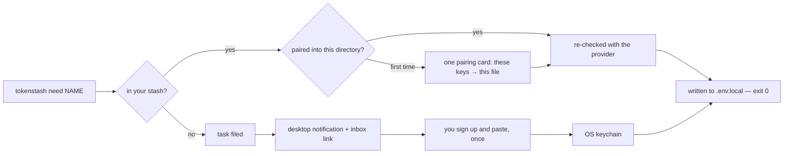
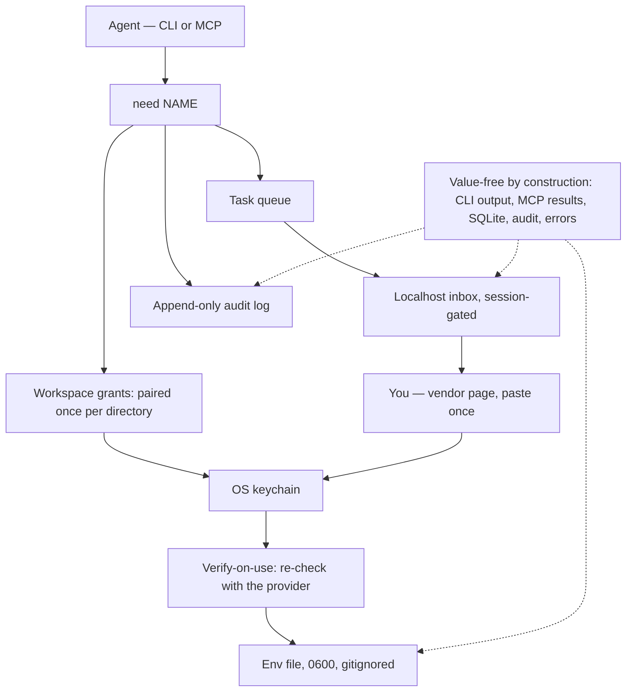

<h1 align="center">tokenstash</h1>

<p align="center">
  <strong>Paste a key once. Every directory that needs it afterwards gets one card, then silence — in any agent.</strong>
</p>

<p align="center">
  tokenstash is a local credential broker for coding agents. The agent runs one command instead of stalling on <code>Please paste your API key</code>; keys you already own are injected into the project's env file, keys you don't get you a link and a desktop notification. Secret values never enter the agent's context, its output, or any log.
</p>

<p align="center">
  <a href="https://github.com/kgarg2468/tokenstash/releases/latest"><strong>Download</strong></a> ·
  <a href="crates/core/registry/providers.json"><strong>Provider registry</strong></a> ·
  <a href="docs/registry-verification.md"><strong>Verification record</strong></a>
</p>

<p align="center">
  
  
  
  
  
  
  
  
</p>

## Product

Coding agents stall on the same line every new project:

```
Please provide: OPENAI_API_KEY= RESEND_API_KEY= STRIPE_SECRET_KEY=
```

tokenstash gives the agent one command instead. If the key is already in your stash it is written into the project's env file instantly. If it isn't, the agent shows you a link (and your desktop gets a notification); you click it, follow it to the vendor's own page, paste once, and the agent resumes. The second project that needs that key shows you one card naming the directory and the file; after that it never involves you.

```
agent › tokenstash need OPENAI_API_KEY RESEND_API_KEY TAVUS_API_KEY
      ✓ OPENAI_API_KEY injected → .env.local
      ✓ RESEND_API_KEY injected → .env.local
      ⏳ TAVUS_API_KEY pending — task t_7fa2 → http://127.0.0.1:7433/t/t_7fa2
```

Works with Claude Code, Codex, Cursor, Gemini CLI, and anything that can run a shell command. MIT, local-only, no accounts, no telemetry, never in the request path.

## First Run

| Step | What you do | tokenstash output |
| --- | --- | --- |
| Init | `tokenstash init` | Keychain backend chosen, MCP server registered with every agent found, skill file installed |
| Ask | The agent needs a key it has never seen | Task filed, desktop notification, localhost inbox link printed for the chat |
| Paste | You open the vendor page and paste once | Pattern checked, liveness probed, stored in the OS keychain |
| Inject | Nothing — the agent re-runs the same command | Written to `.env.local`, `0600`, `.gitignore` enforced, exit `0` |
| Reuse | A different project, a different agent, next week | One **pairing card** the first time that directory asks for stored keys — you see exactly which keys go into which file: **Allow these**, **Allow these + any non-sensitive key here** (for that identity), or **Deny** (remembered for a day). Silent there from then on |



## Architecture

| Layer | Stack | Role |
| --- | --- | --- |
| CLI | Rust 2021, clap 4 | `need` is the whole product surface an agent touches |
| Stash | `keyring` 3, OS-native | macOS Keychain, Windows Credential Manager, Linux Secret Service, kernel-keyring fallback; `insecure-file` is CI-only and warns |
| Index | SQLite (`rusqlite`, bundled) | Names, identities, projects, grants, tasks, audit log — metadata only, never a value |
| Inbox | `tiny_http` bound to `127.0.0.1` | Two-scope session tokens, `HttpOnly; SameSite=Strict` cookie, CSRF double-submit, empty 404 for anything unauthenticated |
| MCP | stdio JSON-RPC server | `secrets_request`, `secrets_list`, `secrets_report_invalid`, `human_request`, `task_check`, `task_list` |
| Registry | `crates/core/registry/providers.json` | 79 providers: signup URL, ordered steps, key pattern, optional liveness check |
| Validation | `validate.rs` over `ureq` | Prefix check at paste time, cheap liveness call, `reject_status` for providers that do not spell auth failure `401` |
| Portability | argon2 + chacha20poly1305 | `export` / `import`: one passphrase-encrypted bundle moves a stash between machines |
| Release | GitHub Actions on `v*` tags | Four platform binaries, sha256 sidecars, Homebrew formula |



## What It Proves

| Question | tokenstash answer |
| --- | --- |
| Can an agent get a credential without pasting it into a chat? | Yes. `need` is the only path, and it returns an exit code, not a value. Values go clipboard → keychain → env file and are never rendered anywhere the model can read them. |
| Does "never leaks" mean anything mechanically? | Yes. [`scripts/leak-test.sh`](scripts/leak-test.sh) drives the real binary with a canary secret and asserts the canary appears in none of stdout, stderr, the SQLite index, the config, the audit log, or MCP output — a black-box test, not an inspection of the code that was supposed to redact. |
| Is loopback treated as authentication? | No, and that is the point. Every inbox request needs a 32-byte session token that arrives as `?t=` on the link you click and becomes an `HttpOnly; SameSite=Strict` cookie. Anything without one gets an empty 404. |
| Can a model approve its own request? | No. The link an agent prints carries the **paste-scope** token: enough to answer a missing-key card, not enough to approve. The **full-scope** token reaches you only through channels you trigger — the notification, `tokenstash open`, your terminal. |
| Can a hostile repo get a key delivered just by asking for it? | No. Nothing is trusted by folder. The first time a directory asks for a stored key you see one card naming the directory, the file, and every key with its sensitivity — approve exactly those, "these plus any non-sensitive registry key here", or deny. A paste grants one key to one directory; sensitive and unregistered keys need their own yes per directory; a program's own output choosing a key asks every time. A copy that carries its own `.env.local` with the same value needs no card and gains no grant (non-sensitive registry keys; file yours, untracked, not a symlink). The MCP server binds one directory at startup — the one your agent opened — refuses to act for any other, and refuses `/`, your home, tool and shared temp dirs outright. `tokenstash workspaces` lists and revokes it all (values already written stay written); every delivery is audited with the grant that allowed it. |
| Can a revoked key be caught before the agent burns a turn on a 401? | Usually. A key unchecked for a day is re-verified with its provider before delivery — one free, read-only request to the host your code already calls. A dead key becomes a "Replace" card; a provider outage just delivers the key unchecked. |
| Is the provider registry actually true? | It was checked, row by row, by HTTP request rather than recollection — 18 dead URLs fixed, 5 checks corrected, 1 removed for being decoration, and the rows that could not be settled say so. The record is [`docs/registry-verification.md`](docs/registry-verification.md); reproduce it with [`scripts/verify-registry.py`](scripts/verify-registry.py). |

## Upgrading from 0.1

Existing per-project approvals become grants automatically — for directories that still exist and were not re-created since. `trust_roots` in `config.toml` stop applying, so a project that was silent only because of a root shows one pairing card (unless its `.env.local` already holds the value); `tokenstash trust rm DIR` tidies the old list. `need`/`ask` lost `--project` (the directory you run them in is the project), the MCP tools lost their `project` argument, and `tokenstash workspaces` replaces `trust`. A 0.1 binary can still open the upgraded database. Details in [CHANGELOG.md](CHANGELOG.md).

## Install

```bash
npm install -g tokenstash      # or: bun add -g tokenstash · pnpm add -g tokenstash
brew install kgarg2468/tokenstash/tokenstash
uv tool install tokenstash     # or: pipx install tokenstash
tokenstash init                # macOS and Linux; Windows is not supported yet
```

The npm package is a launcher plus one prebuilt binary package per platform (`optionalDependencies`, no install scripts — bun and pnpm install it as-is). The PyPI wheels carry the same binary and no Python code. Prebuilt binaries for macOS (arm64, x64) and Linux (x64, arm64; static, any distribution), with sha256 sidecars, are attached to [the latest release](https://github.com/kgarg2468/tokenstash/releases/latest). From source: `cargo install --git https://github.com/kgarg2468/tokenstash tokenstash`.

`init` picks a keychain backend, registers the MCP server with the agents it finds, and installs a skill file so agents reach for it unprompted. It trusts no folder: directories pair once.

- **You create every account.** tokenstash gets you to the right page with the right steps; it never signs up for you, never proxies an API, never reads another tool's credential store.
- **Directories pair once.** The first time a directory asks for keys you already have, one card shows exactly which keys would go into which file; approve, and that directory is silent from then on. Keys tagged sensitive (live Stripe, AWS, service-role) and keys the registry does not know get their own card per directory; the broad button never covers them. Deny is remembered for a day. A directory deleted and re-created at the same path pairs again (`tokenstash workspaces` flags it). A copy that already carries the same value in its own `.env.local` needs no card for non-sensitive registry keys — the file must be yours, untracked and not a symlink; a wrong value there means a card, and no comparison for a day. Nothing is delivered — by CLI or MCP — into `/`, your home, `/tmp`, anything under tool or credential directories (`~/.ssh`, `~/.aws`, `~/.local`, `~/.claude`, …) or the directory holding the stash itself.
- **Local secrets are generated, not requested.** `AUTH_SECRET`, `JWT_SECRET`, `SESSION_SECRET` never involve a human.
- **Verification is tunable.** `verify_every = "24h" | "1h" | "always" | "never"` in `config.toml`; `always` is still at most once a minute per key. Probes that would cost quota, or whose provider cannot distinguish a bad key from a bad request, are never run unattended.

## Commands

| | |
|---|---|
| `tokenstash need NAME… [--why] [--url] [--step …] [--blocking]` | exit `0` injected · `10` pending · `20` denied · `30` expired |
| `tokenstash ask "title" [--url] [--step …] [--expects confirm\|text]` | non-secret human task (DNS, dashboard toggle, OAuth consent) |
| `tokenstash answer [id] [--stdin] [--allow] [--deny]` | answer from the terminal instead of the inbox |
| `tokenstash tasks [--all] [--history]` · `tokenstash open` | what is waiting on you |
| `tokenstash list` · `forget NAME` · `rotate NAME` · `bind NAME --identity work` | manage the stash (never shows values); `bind` after the directory has paired |
| `tokenstash check` · `report-bad NAME --status 401` | prove keys are live; tell tokenstash when a provider rejects one |
| `tokenstash export` · `import` | passphrase-encrypted bundle, to move a stash between machines |
| `tokenstash workspaces [list\|revoke DIR\|forget DIR]` | which directories are paired with which keys; take a directory's grants away (values already written stay). For a person at a terminal — agents cannot list it |
| `tokenstash run -- npm run dev` | zero-config shim: dies on a missing key → asks → restarts. Every key a program's output asks for gets its own yes, each run — never a standing grant |
| `tokenstash mcp` · `inbox` · `doctor` · `audit` · `registry` | |

## What It Is Not

Not a vault — use 1Password or Infisical; backends for them are a later step. Not a proxy: tokenstash is never in the request path, and no traffic of yours flows through it. Not discovery: it never reads `gh`, `aws`, Claude Code or Codex auth state. Not a sandbox: the agent can still read `.env.local`, exactly as it can today. What it removes is the casual leak — the paste into chat, the key echoed back in a summary — and `run --` adds a fresh human yes for every key a program's own output asks for.

## Adding a Provider

[`crates/core/registry/providers.json`](crates/core/registry/providers.json) — one JSON object per key: name, provider, signup URL, ordered steps, key pattern, optional liveness check. PRs welcome; that file is the whole product's breadth. See [CONTRIBUTING.md](CONTRIBUTING.md) and the verification standard in [`docs/registry-verification.md`](docs/registry-verification.md).

## License

MIT
